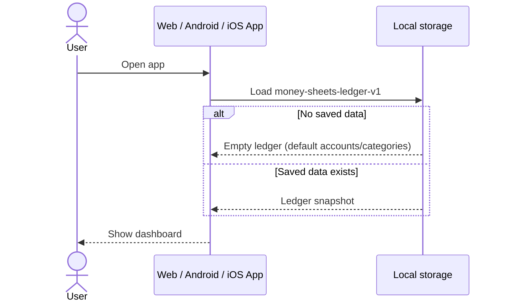
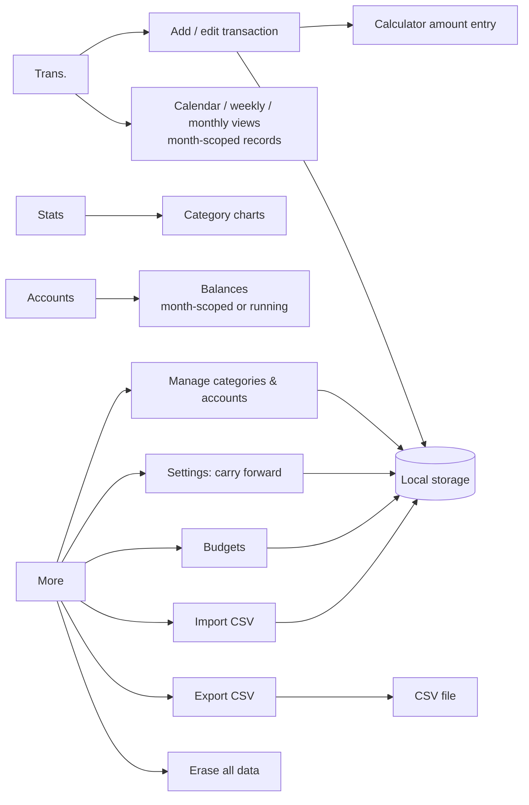
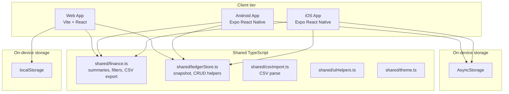
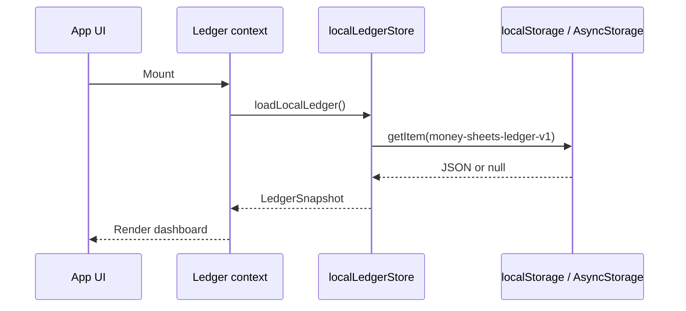
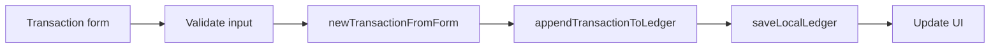
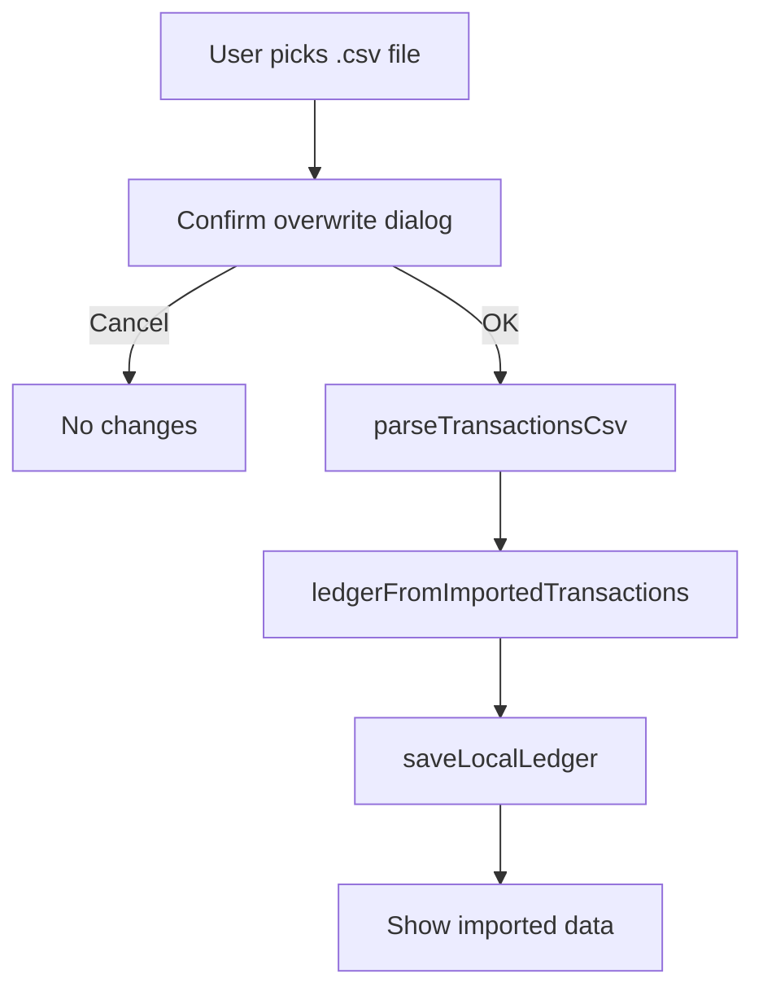

# Money Sheets

A personal expense and income tracker built as an **offline-first** web and mobile app with **local storage** and **CSV backup**. No sign-in, no cloud, no ads.

## What this app does

Money Sheets gives users a simple finance tracker across web and mobile:

- **Web app:** Vite + React
- **Mobile app:** Expo React Native
- **Shared logic:** pure TypeScript in `shared/`
- **Datastore:** on-device only (no Google Cloud, no backend, no billing)
- **Backup / sync:** manual CSV export and import (Excel-friendly)

There is no sign-in step. The app opens directly to the dashboard. Data stays on the device until the user exports it.

To move data between devices, export a CSV from one device and import it on another. Import **replaces all existing local data** after the user confirms.

## Why offline-first?

| Approach | Benefit |
| --- | --- |
| No Google Cloud project | Zero OAuth setup, no API keys for end users |
| No Google Sheets / Drive APIs | No quota, consent screen, or API billing concerns |
| Local storage | Fast reads/writes, works without network after load |
| CSV export | Open in Excel, Google Sheets, or any spreadsheet app |
| CSV import | Restore backups or copy data to a new phone/browser |

Trade-off: there is **no automatic cloud sync**. Users manage backups themselves via CSV.

## Table of contents

1. [End-user app flow](#end-user-app-flow)
2. [Backup and restore (CSV)](#backup-and-restore-csv)
3. [Developer setup](#developer-setup)
4. [Run locally](#run-locally)
5. [Architecture](#architecture)
6. [Local data model](#local-data-model)
7. [Read and write paths](#read-and-write-paths)
8. [CSV format](#csv-format)
9. [Features](#features)
10. [Production and deployment](#production-and-deployment)
11. [Google Play compliance](#google-play-compliance)
12. [Privacy](#privacy)
13. [Troubleshooting](#troubleshooting)
14. [Suggested extensions](#suggested-extensions)

## End-user app flow

### First launch



### Daily use

```text
Open app
-> Load ledger from local storage
-> View Trans. / Stats / Accounts / More
-> Add, edit, or soft-delete transactions
-> Changes saved immediately to local storage
```

### App screens



## Backup and restore (CSV)

### Export

1. Open **More** (or the sidebar on web).
2. Tap **Export CSV**.
3. **Web:** downloads `money-sheets-YYYY-MM.csv`.
4. **Mobile:** opens the system share sheet so the user can save or send the file.

The CSV opens in Excel, LibreOffice, or Google Sheets.

### Import

1. Open **More** → **Import CSV**.
2. Choose a `.csv` file previously exported from Money Sheets (or matching the export format).
3. Confirm the warning:

```text
All existing data on this device will be removed and replaced
with transactions from the file. Budgets will also be reset.
```

4. The app parses the CSV, rebuilds accounts and categories from transaction rows, and saves the new ledger locally.

### Move data between devices

```text
Phone A  --Export CSV-->  email / cloud folder / USB
                              |
Phone B  <--Import CSV--------+
```

Web and mobile use the **same CSV column layout**, so exports are interchangeable.

### What CSV does not include

CSV import/export covers **transactions** only. On import:

- **Accounts** and **categories** are derived from unique values in the transaction rows.
- **Budgets** are cleared (not stored in the CSV file today).

If you need full ledger restore including budgets, see [Suggested extensions](#suggested-extensions) for a possible JSON backup format.

## Developer setup

Use this checklist when joining the project or standing up a new environment.

### 1. Understand the architecture

| Question | Answer |
| --- | --- |
| Where is user data stored? | On the device: `localStorage` (web) or AsyncStorage (mobile) |
| Storage key | `money-sheets-ledger-v1` |
| Is there a custom backend? | No |
| How do web and mobile sync? | Manual CSV export/import by the user |
| Where is shared business logic? | `shared/finance.ts`, `shared/uiHelpers.ts`, `shared/theme.ts`, `shared/ledgerStore.ts`, `shared/csvImport.ts` |
| Where is persistence? | `web/src/localLedgerStore.ts`, `mobile/src/localLedgerStore.ts` |
| Where is app state? | `web/src/ledger.tsx`, `mobile/src/context/LedgerContext.tsx` |

### 2. No Google Cloud setup required

You do **not** need:

- A Google Cloud project
- OAuth clients
- Google Sheets or Drive APIs
- `VITE_GOOGLE_WEB_CLIENT_ID` or mobile OAuth env vars

Optional `web/.env` and `mobile/.env` files may exist for future configuration; they are not required for the offline app.

### 3. Verify the happy path

1. Open the web app at `http://localhost:5173`.
2. Confirm the dashboard loads without sign-in.
3. Add a transaction and refresh the page — data should persist.
4. Export CSV and open the file in Excel.
5. Erase all data (or use a fresh browser profile).
6. Import the CSV and confirm the transaction reappears after confirming the overwrite dialog.
7. Repeat export/import on mobile if you are testing the native app.

## Run locally

### Web

```bash
cd web
npm install
npm run dev
```

Open:

```text
http://localhost:5173
```

Other useful commands:

```bash
npm run typecheck
npm run build
npm run preview
```

### Mobile

```bash
cd mobile
npm install
npx expo start
```

For a native development build:

```bash
npx expo prebuild --clean
npx expo run:android
# or
npx expo run:ios
```

Expo Go works for basic UI testing. Document picker import is most reliable on a development build.

### Mobile dependencies (offline)

| Package | Purpose |
| --- | --- |
| `@react-native-async-storage/async-storage` | Persist ledger JSON on device |
| `expo-document-picker` | Pick CSV file for import |
| `expo-file-system` | Read picked file contents |
| `react-native-svg` | Render the Stats pie chart |

> **Expo Go note:** this project targets **Expo SDK 56**, so use the latest **Expo Go** from the
> Play Store / App Store. Older Expo Go versions show "Project is incompatible with this version of
> Expo Go." For full fidelity (document picker, native modules), use a development build.

## Architecture

### System context



### Repository layout

```text
money-sheets-starter/
├── shared/
│   ├── finance.ts          # Types, summaries, filters, balances, carry-forward, CSV export
│   ├── ledgerStore.ts      # LedgerSnapshot, settings, defaults, CRUD, import merge
│   ├── csvImport.ts        # parseTransactionsCsv
│   ├── calc.ts             # Safe calculator expression evaluator (shared by web + mobile)
│   ├── uiHelpers.ts
│   └── theme.ts
├── web/
│   └── src/
│       ├── App.tsx
│       ├── Calculator.tsx          # Calculator modal (amount entry)
│       ├── ledger.tsx              # React context, load/save/import/export, settings
│       └── localLedgerStore.ts     # localStorage adapter
└── mobile/
    └── src/
        ├── context/
        │   └── LedgerContext.tsx
        ├── localLedgerStore.ts     # AsyncStorage adapter
        ├── screens/
        └── components/
            └── Calculator.tsx      # Calculator bottom-sheet (amount entry)
```

### Design principles

| Principle | Implementation |
| --- | --- |
| Offline-first | All reads/writes go to local storage first |
| No cloud dependency | No third-party APIs required to run the app |
| User-owned backups | CSV files belong to the user; store them anywhere |
| Explicit import overwrite | Import always confirms before replacing data |
| Soft delete | Transactions are marked `deleted: true`, not removed |
| Shared logic | Finance math and CSV format live in `shared/` |
| Same CSV on web and mobile | One interchange format for manual sync |

## Local data model

The app persists a single JSON document: `LedgerSnapshot`.

```ts
type LedgerSnapshot = {
  version: number;           // LEDGER_STORAGE_VERSION (currently 2)
  updatedAt: string;         // ISO timestamp
  transactions: Transaction[];
  accounts: Account[];
  categories: Category[];
  budgets: Budget[];
  settings: LedgerSettings;  // app preferences (see below)
};

type LedgerSettings = {
  carryForward: boolean;     // default false — see "Monthly carry forward"
};
```

Storage key: `money-sheets-ledger-v1`

> Older snapshots saved before `settings` existed are migrated automatically on load:
> `parseStoredLedger()` fills in `settings: { carryForward: false }` when the field is missing.

### Default seed data

On first launch, `createDefaultLedger()` in `shared/ledgerStore.ts` provides:

- **Accounts:** Cash, Bank, Savings (INR, opening balance 0)
- **Expense categories:** House Groceries 🛒, Food Outing 🍜, Transport & Fuel ⛽, Social Events 👫, House Enhancement 🛠️, Shopping 👕, Doctor 🩺, Misc 📦, Bills & Utilities 💸, Education 📒, Travelling ✈️
- **Income categories:** Salary 💰, Gift 🎁, Other Income 💵
- **Transactions:** empty
- **Budgets:** empty

### Transaction fields

| Field | Type | Notes |
| --- | --- | --- |
| `id` | string | Unique id |
| `date` | string | `YYYY-MM-DD` |
| `type` | `income` \| `expense` | |
| `amount` | number | Positive amount |
| `currency` | string | e.g. `INR` |
| `account` | string | Account name |
| `category` | string | Category name |
| `note` | string | Memo |
| `createdAt` | string | ISO timestamp |
| `createdBy` | string | `local-user` by default |
| `source` | `web` \| `mobile` | Where the row was created |
| `deleted` | boolean | Soft-delete flag |
| `updatedAt` | string? | Set on edit/delete |
| `receiptUrl` | string? | Optional link |

### Account fields

| Field | Type |
| --- | --- |
| `name` | string |
| `currency` | string |
| `openingBalance` | number |
| `active` | boolean |

### Category fields

| Field | Type |
| --- | --- |
| `name` | string |
| `type` | `income` \| `expense` |
| `active` | boolean |

### Budget fields

| Field | Type |
| --- | --- |
| `category` | string |
| `month` | string (`YYYY-MM`) |
| `amount` | number |
| `currency` | string |

### Settings fields

| Field | Type | Default | Notes |
| --- | --- | --- | --- |
| `carryForward` | boolean | `false` | When `true`, balances accumulate across months (running balance). When `false`, each month is independent and nothing carries into the next month. |

## Read and write paths

### App startup



### Add transaction



### Import CSV



`ledgerFromImportedTransactions()` replaces the entire snapshot: new transactions, rebuilt accounts/categories, empty budgets.

### Delete transaction

Transactions are soft-deleted:

```text
deleted: true
updatedAt: <ISO timestamp>
```

Rows remain in storage for possible future undelete or audit features.

## CSV format

Export uses `exportTransactionsCsv()` in `shared/finance.ts`. Import uses `parseTransactionsCsv()` in `shared/csvImport.ts`.

### Header row (required)

```text
id,date,type,amount,currency,account,category,note,createdAt,createdBy,source,deleted,updatedAt,receiptUrl
```

### Example rows

```csv
id,date,type,amount,currency,account,category,note,createdAt,createdBy,source,deleted,updatedAt,receiptUrl
1718366400000-abc,2026-06-14,expense,250,INR,Cash,Food,Lunch,2026-06-14T12:00:00.000Z,local-user,web,FALSE,,
1718366500000-def,2026-06-14,income,50000,INR,Bank,Salary,June salary,2026-06-14T12:05:00.000Z,local-user,web,FALSE,,
```

### Import rules

- File must be `.csv` with the header row above.
- Required columns: `id`, `date`, `type`, `amount`.
- `type` must be `income` or `expense` (anything else is treated as `expense`).
- `deleted` accepts `TRUE` / `FALSE` (case-insensitive).
- At least one valid data row is required.
- Import **replaces** all local data after user confirmation.

## Features

- **No sign-in** — app loads immediately
- **Offline storage** — web `localStorage`, mobile AsyncStorage
- **Tabs:** Trans., Stats, Accounts, More
- **Transactions:** add, edit, soft-delete
- **Month-scoped records** — the transaction list always shows only the selected month
- **Custom categories** — create/remove income and expense categories (More → Manage)
- **Custom accounts** — create/remove accounts with currency and opening balance
- **Built-in calculator** — tap the amount field to enter values with a `+ − × ÷` calculator (safe expression evaluation, no `eval`)
- **Monthly carry forward** — optional setting (off by default) to carry the running balance into the next month
- **Income and expense** tracking with category chips
- **Account balances** with opening balance support (month-scoped or running, per carry-forward setting)
- **Pie chart stats** with an Income / Expenses toggle and per-category percentage breakdown (Stats tab)
- **Calendar, weekly, monthly, summary** views (Trans. tab)
- **Date headers** in the records list show the weekday and full date with the day's net total
- **Monthly budgets** with progress (More tab)
- **CSV export** — Excel-compatible download / share
- **CSV import** — replace local data with confirmation
- **Erase all data** — reset to default empty ledger
- **Receipt URL** field on transactions
- **Modern dark UI**, consistent across web and mobile

| Personal-finance workflow | Money Sheets implementation |
| --- | --- |
| Transaction tracking | `transactions` in local ledger |
| Account tracking | `accounts` + Accounts tab, custom accounts in More |
| Category analysis | Stats tab + `shared/finance.ts` |
| Custom categories / accounts | More → Manage categories & accounts |
| Amount entry | In-app calculator (`shared/calc.ts`) |
| Budgets | `budgets` + More tab |
| Calendar review | Trans. tab calendar view |
| Monthly carry forward | `settings.carryForward` + Settings toggle |
| Export | CSV export |
| Backup / restore | CSV import |
| Receipts | `receiptUrl` field |

### Monthly carry forward

By default each month is **independent**: the Trans. balance and account balances reflect only the
selected month's income and expense. Nothing rolls into the next month.

Enable **More → Settings → Monthly carry forward** to switch to a **running balance**:

- The Trans. summary adds the net of all previous months (plus account opening balances) as
  "brought forward".
- The Accounts tab shows balances accumulated up to and including the selected month.

The setting lives in `settings.carryForward` and is shared by the web and mobile apps through
`shared/finance.ts` (`computeAccountBalances`, `carryOverBalance`).

## Production and deployment

The app is shipped at **v1.0.0**. Both clients are production-configured:

| Area | Status |
| --- | --- |
| Web | Vite production build, PWA manifest, SVG favicon, dark theme meta, render error boundary |
| Mobile | Expo SDK 56, `app.config.js` with app id `com.moneysheets.app`, `versionCode` 1, EAS build profiles |
| Repo | `.gitignore` added, versions bumped to `1.0.0`, no backend/secrets |

### Web hosting

Deploy the static Vite build anywhere:

```bash
cd web
npm install
npm run build
```

Upload `web/dist/` to Vercel, Netlify, Cloudflare Pages, S3 + CloudFront, etc. No server-side
env vars are required.

- Deploying under a sub-path (e.g. GitHub Pages project site)? Build with a base path:
  `VITE_BASE=/money-sheets/ npm run build`.
- Local production smoke test: `npm run preview`.

**Caveat:** each browser profile has its own `localStorage`. Clearing site data removes the ledger unless the user has a CSV backup.

### Build & release (Android APK)

The mobile app builds an installable **APK** through [EAS Build](https://docs.expo.dev/build/introduction/)
(cloud) — no local Android SDK required.

**One-time setup**

```bash
npm install -g eas-cli      # or use: npx eas-cli@latest <cmd>
cd mobile
npm install
eas login                   # create a free Expo account if needed
eas init                    # links the project & writes the EAS projectId
```

**Build the APK** (uses the `preview` profile in `mobile/eas.json` → `buildType: apk`):

```bash
cd mobile
npm run build:apk           # alias for: eas build --platform android --profile preview
```

When the cloud build finishes, EAS prints a download URL for the `.apk`. Download it and
sideload it onto any Android device (enable "Install unknown apps"), or share the link.

**Play Store release** builds an optimized App Bundle (`.aab`):

```bash
npm run build:android       # eas build --platform android --profile production
```

> Build profiles live in `mobile/eas.json`: `development` (dev client APK), `preview`
> (installable APK for testers), and `production` (Play Store AAB, auto-incrementing versionCode).

#### Local build alternative (no EAS)

If you have Android Studio + SDK installed, you can produce an APK locally:

```bash
cd mobile
npx expo prebuild --platform android      # generates the native android/ project
cd android
./gradlew assembleRelease                 # APK at android/app/build/outputs/apk/release/
```

#### Add app icon & splash (recommended before release)

The build currently uses Expo's default icon/splash so it stays green out of the box. To brand it:

1. Add `mobile/assets/icon.png` (1024×1024) and `mobile/assets/adaptive-icon.png` (1024×1024,
   logo centered in the safe zone), plus an optional `mobile/assets/splash.png`.
2. Reference them in `mobile/app.config.js`:

```js
icon: './assets/icon.png',
android: {
  package: ANDROID_PACKAGE,
  versionCode: 1,
  adaptiveIcon: {
    foregroundImage: './assets/adaptive-icon.png',
    backgroundColor: '#0b0e14'
  }
}
```

### Mobile data persistence

Uninstalling the app typically clears AsyncStorage unless the OS restores app data from backup.
Remind users to keep a CSV export as their portable backup.

### Privacy

- Data never leaves the device except when the user exports CSV or shares it.
- No analytics or third-party finance APIs are included by default.
- Receipt URLs are stored as plain text links in local storage.
- A full privacy policy is provided in [`PRIVACY.md`](./PRIVACY.md). Host it at a public URL
  (e.g. GitHub Pages or a gist) and paste that URL into the Play Console listing.

### Google Play compliance

This app is designed to satisfy Google Play policies for a finance utility. Before submitting:

**Privacy policy (required)**

- Publish [`PRIVACY.md`](./PRIVACY.md) at a public URL and add it to *Play Console → App content
  → Privacy policy*. Replace the contact placeholder in the file first.

**Data safety form (Play Console → App content → Data safety)** — suggested answers for the
current offline build:

| Question | Answer |
| --- | --- |
| Does your app collect or share user data? | **No** (all data stays on-device; nothing is sent to the developer or third parties) |
| Is data processed only on the device? | **Yes** |
| Data encrypted in transit? | Not applicable (no data is transmitted by the app) |
| Can users request data deletion? | **Yes** — in-app *Erase all data*, or uninstall |

**Permissions**

- Only file access is used, and only when the user taps *Import CSV*. No location, contacts,
  camera, microphone, or background permissions are requested.

**Other policy items**

- **App name / branding:** "Money Sheets" — original, with no third-party trademarks, logos, or
  "inspired by" references in the app, store listing, or code.
- **No ads, no in-app purchases, no account/sign-in.**
- **Package id:** `com.moneysheets.app` (no `com.example.*`). Change it in `mobile/app.config.js`
  if you publish under your own organization.
- **Content rating:** complete the *Play Console → App content → Content rating* questionnaire
  (a finance app with no objectionable content rates "Everyone").
- **Target audience:** not directed at children; the app collects no data.

> If you later add analytics, crash reporting, ads, or cloud sync, update `PRIVACY.md` and the
> Data safety form accordingly — those introduce data collection that must be disclosed.

### Recommended user messaging

On first load, the app explains that data is stored locally and CSV is the backup path.

Before import:

```text
Import will remove all existing data on this device and replace it
with transactions from the selected file. Budgets will be reset.
```

Before erase:

```text
Erase all local data? Export a CSV first if you need a backup.
```

## Troubleshooting

### Data disappeared after clearing browser data

`localStorage` is cleared when the user clears site data or uses a private window.

**Fix:** Import a previously exported CSV.

### Web and mobile show different numbers

There is no live sync between platforms.

**Fix:** Export CSV from the source device and import on the target device.

### Import fails with "missing required column"

The CSV must include the exact header row from an Money Sheets export.

**Fix:** Re-export from the app or add the missing columns to match the [CSV format](#csv-format).

### Import fails with "No valid transaction rows"

The file may be empty, use a different delimiter, or have invalid rows (missing `id`).

**Fix:** Open the file in Excel, confirm comma-separated values and a header row, then save as CSV again.

### Budgets missing after import

Budgets are not part of the CSV format. Import resets budgets to empty.

**Fix:** Re-enter budgets in the More tab, or implement JSON full-backup (see extensions).

### Mobile import does nothing

Confirm you tapped **Import** on the confirmation dialog. On some Android versions, file access requires a development build rather than Expo Go.

### `localStorage` quota exceeded (web)

Very large ledgers (thousands of transactions) may hit browser storage limits (~5 MB typical).

**Fix:** Export CSV, erase old data, or implement IndexedDB migration in a future version.

## Suggested extensions

- **JSON full backup** — export/import budgets, accounts, and categories in one file
- **Recurring transactions**
- **Multi-currency exchange rates**
- **Optional cloud sync** — iCloud, Google Drive folder, or self-hosted API (would reintroduce cloud setup)
- **IndexedDB on web** — larger storage quota than `localStorage`
- **Import from other trackers** — map third-party CSV columns to the Money Sheets format
- **Undelete** UI for soft-deleted transactions
- **Encryption at rest** — password-protected local ledger
- **Household / shared ledgers** — would need sync or shared file workflow

## License

Add your license here.

Example:

```text
MIT
```
