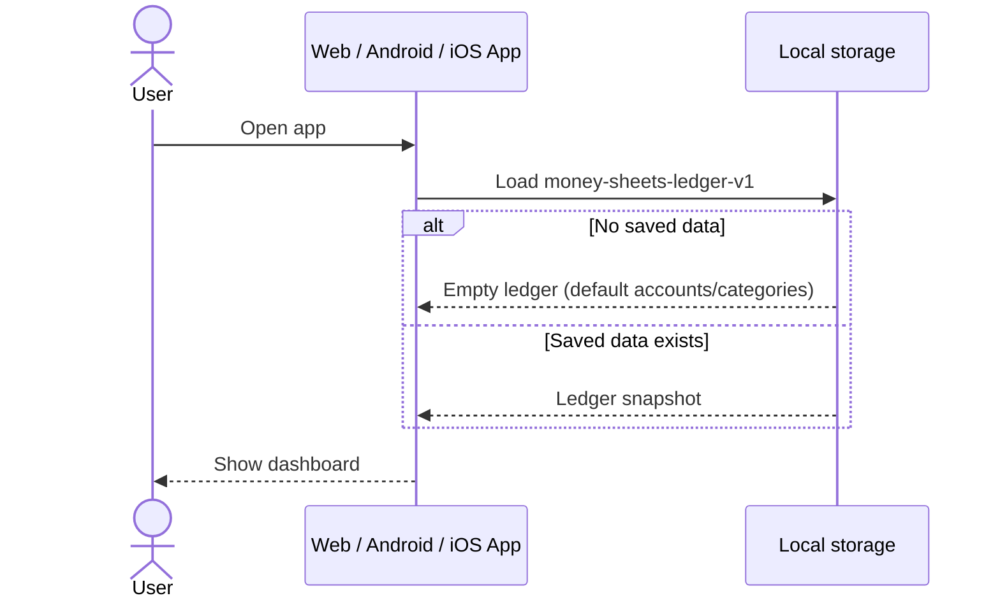
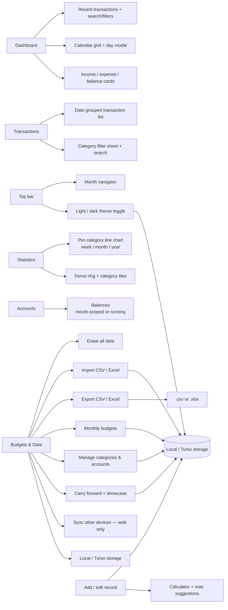
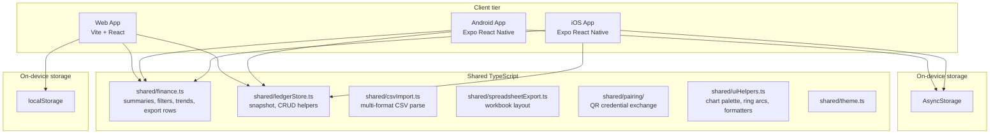
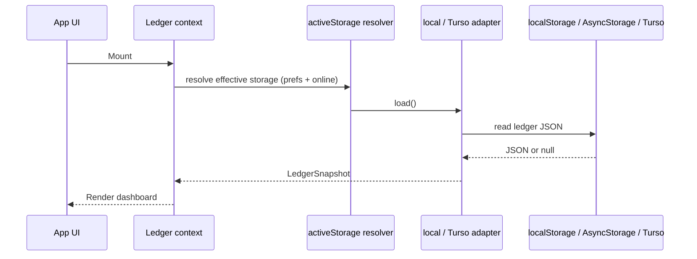
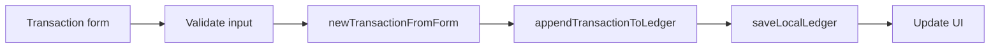
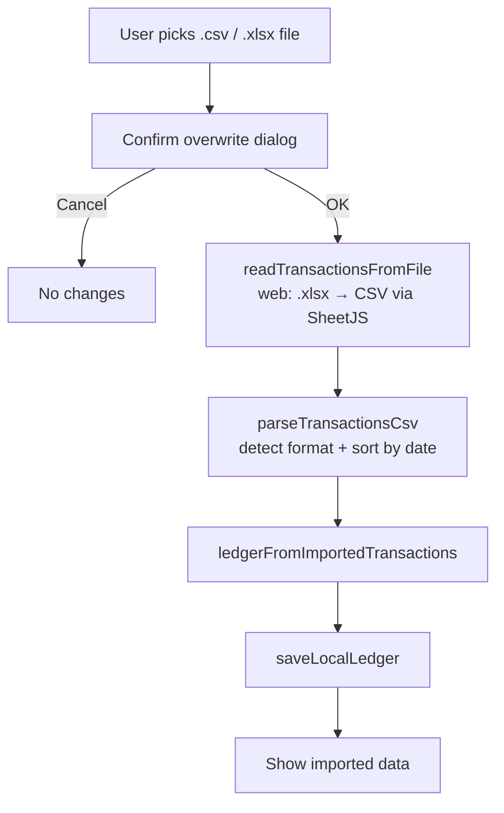

# Money Sheets

A personal expense and income tracker built as an **offline-first** web and mobile app with **local storage** and **CSV / Excel backup**. No sign-in, no ads, no developer backend.

Both the **web and mobile** apps support an **optional Turso (libSQL) cloud database** so you can sync the same ledger across devices using your own credentials. Local storage remains the default — Turso is entirely opt-in. See [Storage modes](#storage-modes).

The mobile app (iOS + Android, Expo) mirrors the web mobile layout: five tabs (**Dashboard**, **Statistics**, **Transactions**, **Accounts**, **Budgets & Data**), a **light/dark theme toggle**, ring + trends charts, editable categories/accounts, showcase mode, CSV + Excel import/export, and optional Turso sync. See the [mobile parity table](#web--mobile-feature-parity).

## What this app does

Money Sheets gives users a simple finance tracker across web and mobile:

- **Web app:** Vite + React, with a **light/dark theme toggle**
- **Mobile app:** Expo React Native
- **Shared logic:** pure TypeScript in `shared/`
- **Datastore:** on-device only
- **Backup / sync:** manual export and import. Both clients read `.csv`, `.xlsx`, and `.xls` and can export **CSV or Excel** (`.xlsx` workbooks on web; CSV or `.xlsx` on mobile).
- **Import compatibility:** besides its own export, the importer also reads common spreadsheet dumps (a sheet with `Date`, `Category`, `Amount`, `Income/Expense` columns — e.g. exports from other money managers), auto-detecting the format and sorting by date.

There is no sign-in step. The app opens directly to the dashboard. Data stays on the device until the user exports it.

To move data between devices, export a CSV from one device and import it on another. Import **replaces all existing local data** after the user confirms.

## Why offline-first?

| Approach | Benefit |
| --- | --- |
| Local storage | Fast reads/writes, works without network after load |
| CSV / Excel export | Open in Excel, Google Sheets, or any spreadsheet app |
| CSV / Excel import | Restore backups, or migrate data from other money managers |

Trade-off: by default there is **no automatic cloud sync**; users manage backups themselves via CSV / Excel files. If you want cross-device sync without giving up the offline-first model, the web app can optionally use [Turso](#storage-modes).

## Storage modes

The web app can store its ledger in one of two places. You choose this in the app under **Budgets & Data → Storage**.

| Mode | Where data lives | Sync | Default |
| --- | --- | --- | --- |
| **Local Storage** | This browser only (`localStorage`) | None — export/import CSV to move data | Yes |
| **Turso DB** | Your Turso (libSQL) database in the cloud | Across any device using the same credentials | No |

Locally the ledger is stored as a single JSON snapshot in `localStorage`. On **web**, Turso now uses a **normalized schema** — separate `transactions`, `accounts`, `categories`, `budgets`, and `settings` tables — so adding one transaction writes one row instead of re-uploading the whole ledger, and the `transactions` table is indexed by `month` for fast scoped queries. The web app still assembles a full snapshot for the UI, so the data shape the screens see is unchanged. *(The mobile app still uses the single-row `ledger_snapshot` model; see the migration note below.)*

#### Migration from the old single-blob table

The first time the web app connects to a Turso database that still holds the old `ledger_snapshot` JSON, it migrates automatically:

- It creates the normalized tables and copies every transaction, account, category, budget, and setting into them.
- The original blob is preserved in a `ledger_snapshot_backup` table, and the database is stamped (`schema_meta.schema_version = 2`).
- Migration is **idempotent** — it runs once and is safely skipped on every later connect. An interrupted migration simply re-runs, because every write is an upsert keyed by primary key.

> Mixed clients: the **mobile** app still reads/writes the old `ledger_snapshot` blob, which the web app stops updating after migration. Until mobile is upgraded, use one client per Turso database to avoid divergence.

### How Turso mode behaves (web)

When online with Turso active, **every edit writes straight to Turso** (one row per change) and mirrors to the local cache. The app handles four connection cases on boot, on a storage-mode switch, and on reconnect:

| Case | This device | Turso | Behavior |
|---|---|---|---|
| 1 | Empty | Empty | Start fresh; new edits write to Turso and mirror to the local cache. |
| 2 | — | — (offline) | Operate on the local cache only; reconcile on reconnect. |
| 3 | Empty | Has data | Pull Turso into the UI and local cache. |
| 4 | Has data | Has data | If only one side changed since the last sync, reconcile automatically (see below). On a genuine two-sided change, **prompt**: keep this device (overwrites Turso) or keep Turso (overwrites this device). No silent merge. |

#### Lightweight, metadata-first sync (no polling, no backend)

Sync is **not** real-time. Instead the app runs a cheap check — comparing the `ledger_updated_at` marker in the `settings` table, **without downloading the whole ledger** — triggered by natural interactions:

- App start, and when the tab/PWA regains focus or becomes visible again (`focus` / `visibilitychange` / `pageshow`).
- Navigating between major sections (Dashboard → Statistics → Transactions → …).
- Coming back online.

These automatic checks are **throttled** (a 30-second cooldown) and de-duplicated, so rapid tab switching issues at most one request. A persisted *last-synced revision* baseline lets the app tell a one-sided change from a real conflict:

- **Cloud newer** (only Turso changed) → **auto-pull** the latest ledger and update the UI.
- **Local newer** (only this device changed, e.g. offline edits) → **auto-push** to Turso. This is safe because the cloud still matches the baseline, so nothing is overwritten — no prompt.
- **Diverged** (both changed since the last sync) → flag a **conflict**; resolve it with **Refresh** (Push local / Use cloud).

#### Sync status states

A **sync status** indicator (sidebar on desktop, top bar on mobile) shows a richer state with an icon, label, and — when synced — a relative *"Last synced X ago"*:

| State | Meaning |
|---|---|
| 🟢 **Up to date** | In sync with the cloud. |
| 🟡 **Checking…** | A lightweight metadata check is in flight. |
| 🔵 **Syncing…** | Downloading/uploading the ledger. |
| 🟡 **Not synced** | This device has changes not yet pushed (transient; auto-pushes on the next check). |
| ⚠️ **Conflict detected** | Both sides changed — choose which copy to keep. |
| 🔴 **Offline** | No connectivity; using local data. |
| ⚪ **Local only** | Turso not configured. |

A **Refresh** control forces an immediate check (bypassing the cooldown): desktop uses the **Refresh** action in the sidebar, and mobile web shows a Refresh button beside the status pill.

- **Offline:** the app falls back to the local cache and marks Turso unavailable. You can keep working; changes are saved locally and pushed automatically once you reconnect (unless a true conflict requires your choice).
- **Switching modes** copies your current data into the target store, confirming before replacing existing data.
- **Budgets & Data → Import from Excel file:** when Turso mode is active, you can import an Excel/CSV file and push it straight to Turso (replacing the remote database and the local cache). This is disabled while offline.

### Set up Turso

1. Create a free database at [turso.tech](https://turso.tech) (or with the Turso CLI: `turso db create money-sheets`).
2. Get the database URL (looks like `libsql://your-db-name.turso.io`).
3. Create an auth token (`turso db tokens create money-sheets`).
4. In the app, open **Budgets & Data → Sync Other Devices**, expand **Advanced**, paste the URL and token, and click **Test connection**.
5. Click **Save & Reload**. The app creates the table if needed and uploads your current data. To add more devices afterwards, use the pairing QR described in [Sync Other Devices](#sync-other-devices-pairing) instead of retyping credentials.

Your URL and token are stored only on your device (in `localStorage` on web, AsyncStorage on mobile) and are never sent anywhere except directly to your Turso database over HTTPS. Because all calls go from the client to Turso's HTTP API, this works on static hosts like GitHub Pages and inside the mobile app with no backend.

### Sync Other Devices (pairing)

Once one device is connected to Turso, you can add more without retyping the long URL and token. Open **Budgets & Data → Sync Other Devices** on the connected device and tap **Generate pairing QR**. It shows a QR code plus a 6-digit pairing code that expires after 5 minutes.

On the **new device**, open the same panel in the **web app** (including mobile-browser / PWA layout) and tap **Scan QR**, point the camera at the first device, then type the 6-digit code to confirm. The receiving device tests the connection and joins the same sync — no manual typing.

> **Native mobile app (Expo):** pairing QR is not available yet. Add a device by pasting the Turso URL and auth token under **Budgets & Data → Storage**.

How it stays safe without a backend:

- The QR contains an **AES-256-GCM encrypted** payload, never the raw credentials. The key is derived (PBKDF2) from the 6-digit code, which is shown as text next to the QR and is **never encoded in it** — so a photo of the QR alone is useless.
- The payload is signed with an HMAC so a tampered or non-Money-Sheets QR is rejected before decryption, and it **expires after 5 minutes** (enforced on both devices, with a small clock-skew allowance). There is no server, so security relies on physical proximity plus this short window — regenerate the QR if it lapses.
- Desktop browsers show **Generate pairing QR** only (join a desktop via the **Advanced** section). The **Scan QR** button appears in the web app's mobile layout (narrow viewport or phone browser). Both options require cloud sync to be active first.
- Power users can still paste a database URL and token directly under **Sync Other Devices → Advanced**.

### Turso on mobile

The mobile app uses the **same** `shared/storage/` types, schema, and preferences as the web app. Setup: open **Budgets & Data → Storage**, choose **Turso**, paste your database URL and auth token, tap **Test connection**, then **Save storage settings**.

- Credentials are persisted in AsyncStorage under the same `money-sheets-storage-prefs-v1` key.
- Turso on mobile still uses the legacy single-row `ledger_snapshot` blob (web migrates to normalized tables — see [Migration](#migration-from-the-old-single-blob-table)). Use one Turso database per client family until mobile catches up.
- Connectivity is detected with `@react-native-community/netinfo`. When the device goes offline, the app falls back to the local AsyncStorage cache and shows Turso as unavailable; a reconnect banner offers **push local / use cloud** when the copies diverge.
- The libSQL client (`@libsql/client`) talks to Turso over HTTPS via `fetch`, and is lazy-imported so offline-only installs don't pay its cost.

## Web & mobile feature parity

The mobile app mirrors the web mobile layout. Tab ids live in `shared/nav.ts`; labels are **Dashboard**, **Statistics**, **Transactions**, **Accounts**, and **Budgets & Data**.

| Area | Web (mobile layout) | Mobile (iOS + Android) |
| --- | --- | --- |
| Tabs | Dashboard, Statistics, Transactions, Accounts, Budgets & Data | ✅ Same five tabs with per-tab accent tints |
| Theme | Light + dark toggle | ✅ Light + dark toggle (persisted) |
| Storage | Local + Turso + offline fallback | ✅ Local + Turso + offline fallback |
| Sync status | Rich pill (up to date / checking / conflict / offline) + Refresh | ✅ Storage status line + reconnect banner |
| Device pairing (QR) | Generate + scan on mobile web layout | Manual Turso credentials only (no QR scanner) |
| Dashboard | KPI cards, calendar, top categories, recent transactions + filters | ✅ Summary strip, calendar / summary views, day modal |
| Statistics | KPIs, ring breakdown, trends line chart | ✅ KPIs, ring (react-native-svg), trends |
| Transactions | Category filter sheet, search, date-grouped list, scroll-to-top | ✅ Same (`CategoryFilterSheet`, `TransactionGroups`) |
| Add record | Full-screen sheet: type toggle, description autocomplete, calculator, receipt | ✅ Full-screen modal: `DD/MM/YYYY` date field, note suggestions, calculator |
| Accounts | Editable cards (name, emoji, color, currency, opening) | ✅ Same |
| Budgets & Data | Storage, sync, budgets, manage, import/export, settings | ✅ Same (storage panel, budgets, manage, backup) |
| Showcase mode | Demo data with confirmation | ✅ Same |
| Import / export | CSV + Excel with progress | ✅ CSV + Excel with progress overlay |
| Branding | ₹/bar-chart purple-gradient mark | ✅ Matching icon, adaptive icon, splash |

## Table of contents

1. [Storage modes](#storage-modes)
2. [Web & mobile feature parity](#web--mobile-feature-parity)
3. [End-user app flow](#end-user-app-flow)
4. [Backup and restore (CSV / Excel)](#backup-and-restore-csv--excel)
5. [Developer setup](#developer-setup)
6. [Run locally](#run-locally)
7. [Architecture](#architecture)
8. [Local data model](#local-data-model)
9. [Read and write paths](#read-and-write-paths)
10. [Import & export formats](#import--export-formats)
11. [Features](#features)
12. [Production and deployment](#production-and-deployment)
13. [Store submission](#store-submission)
14. [Privacy](#privacy)
15. [Troubleshooting](#troubleshooting)
16. [Suggested extensions](#suggested-extensions)

## End-user app flow

### First launch



### Daily use

```text
Open app
-> Load ledger from active storage (local or Turso)
-> Dashboard: month KPIs, calendar, recent activity
-> Transactions: browse/filter the month's ledger by category
-> Statistics / Accounts / Budgets & Data as needed
-> Add, edit, or soft-delete transactions
-> Changes saved immediately to storage
```

### App screens



## Backup and restore (CSV / Excel)

### Export

1. Open **Budgets & Data** (or the sidebar on web).
2. Tap **Export Excel** (web sidebar) or **Export CSV** / **Export Excel (.xlsx)** (mobile).
3. **Web:** a dialog asks where to save the workbook:
   - **Download to default location** — saves `money-sheets.xlsx` to your Downloads folder (works in every browser).
   - **Choose a location…** — pick a file to create or replace on your device (Chrome/Edge, via the
     File System Access API). In Safari and Firefox only the default download is offered.

   A progress overlay shows while the workbook is built.
4. **Mobile:** opens the system share sheet so the user can save or send a CSV or `.xlsx` file.

The web workbook (`money-sheets.xlsx`) contains:

- **All Transactions** — every transaction (this sheet stays first so imports keep working).
- One **`YYYY-MM`** sheet per month (e.g. `2026-06`), each holding only that month's transactions.
- **Summary** — one row per month with `Month`, `Income`, `Expense`, `Net`, and `Transaction Count`.

Both formats open in Excel, LibreOffice, or Google Sheets.

### Import

1. Open **Budgets & Data** → **Import CSV / Excel** (web sidebar or mobile backup card).
2. Choose a file:
   - On **web**, you can pick `.csv`, `.xlsx`, or `.xls`.
   - It can be a previous Money Sheets export, **or** a spreadsheet from another money manager
     (any sheet with `Date`, `Category`, `Amount`, and an `Income/Expense` column — see
     [Import & export formats](#import--export-formats)).
3. Confirm the warning:

```text
All existing data on this device will be removed and replaced
with transactions from the file. Budgets will also be reset.
```

4. The app parses the file (Excel is converted to rows in-memory via SheetJS), auto-detects the
   column layout, **sorts the rows by date**, rebuilds accounts and categories from the transaction
   rows, and saves the new ledger locally.

> **Multi-sheet workbooks:** import reads the master transaction sheet by name — it prefers
> `All Transactions`, then a legacy `Transactions` sheet, then the first sheet whose header row
> matches the native format. The monthly `YYYY-MM` and `Summary` sheets are ignored, so you never
> need to import each month individually. Older single-sheet exports still import unchanged.

### Move data between devices

```text
Phone A  --Export CSV / Excel-->  email / cloud folder / USB
                                      |
Phone B / Web  <--Import------------- +
```

Money Sheets exports use the **same column layout** on web and mobile, so they are interchangeable;
the web app additionally accepts third-party spreadsheet dumps.

### What CSV does not include

CSV import/export covers **transactions** only. On import:

- **Accounts** and **categories** are derived from unique values in the transaction rows.
- **Budgets** are cleared (not stored in the CSV file today).

If you need full ledger restore including budgets, see [Suggested extensions](#suggested-extensions) for a possible JSON backup format.

## Developer setup

Use this checklist when joining the project or standing up a new environment.

### 1. Understand the architecture

| Question | Answer |
| --- | --- |
| Where is user data stored? | On the device: `localStorage` (web) or AsyncStorage (mobile) |
| Storage key | `money-sheets-ledger-v1` |
| Is there a custom backend? | No |
| How do web and mobile sync? | Manual CSV / Excel export/import by the user |
| Where is shared business logic? | `shared/finance.ts`, `shared/uiHelpers.ts`, `shared/theme.ts`, `shared/nav.ts`, `shared/ledgerStore.ts`, `shared/csvImport.ts`, `shared/spreadsheetExport.ts`, `shared/spreadsheetImport.ts`, `shared/showcaseData.ts`, `shared/pairing/`, `shared/sync/`, `shared/storage/` |
| Where is persistence? | `web/src/storage/`, `mobile/src/storage/` (local + Turso adapters behind a shared interface; web Turso uses normalized tables) |
| Where is app state? | `web/src/ledger.tsx`, `mobile/src/context/LedgerContext.tsx` |
| Where is the theme? | Web: `web/src/theme.tsx` + CSS vars in `web/src/styles.css`. Mobile: `mobile/src/theme/ThemeProvider.tsx` + tokens in `shared/theme.ts` |
| Where is Excel read/write? | `web/src/spreadsheet.ts` and `mobile/src/spreadsheet.ts` (SheetJS wrappers; workbook layout in `shared/spreadsheetExport.ts`) |

### 2. No Google Cloud setup required

You do **not** need:

- A Google Cloud project
- OAuth clients
- Google Sheets or Drive APIs
- `VITE_GOOGLE_WEB_CLIENT_ID` or mobile OAuth env vars

Optional `web/.env` and `mobile/.env` files may exist for future configuration; they are not required for the offline app.

### 3. Verify the happy path

1. Open the web app at `http://localhost:5173`.
2. Confirm the dashboard loads without sign-in.
3. Add a transaction and refresh the page — data should persist.
4. Export CSV and open the file in Excel.
5. Erase all data (or use a fresh browser profile).
6. Import the CSV and confirm the transaction reappears after confirming the overwrite dialog.
7. Repeat export/import on mobile if you are testing the native app.

## Run locally

### Web

```bash
cd web
npm install
npm run dev
```

Open:

```text
http://localhost:5173
```

Other useful commands:

```bash
npm run typecheck
npm run test
npm run build
npm run preview
```

### Mobile

```bash
cd mobile
npm install
npx expo start
```

For a native development build:

```bash
npx expo prebuild --clean
npx expo run:android
# or
npx expo run:ios
```

Expo Go works for basic UI testing. Document picker import is most reliable on a development build.

### Mobile dependencies (offline)

| Package | Purpose |
| --- | --- |
| `@react-native-async-storage/async-storage` | Persist ledger JSON + storage/theme prefs on device |
| `@react-native-community/netinfo` | Detect connectivity for Turso online/offline fallback |
| `@libsql/client` | Optional Turso cloud sync over HTTPS (lazy-imported) |
| `expo-document-picker` | Pick CSV / Excel file for import |
| `expo-file-system` | Read picked file contents; write export files |
| `expo-sharing` | Share exported CSV / Excel files |
| `react-native-svg` | Render the Statistics ring breakdown and trends line chart |
| `xlsx` (SheetJS) | Read/write `.xlsx` on import/export (lazy-imported) |

> **Expo Go note:** this project targets **Expo SDK 56**, so use the latest **Expo Go** from the
> Play Store / App Store. Older Expo Go versions show "Project is incompatible with this version of
> Expo Go." For full fidelity (document picker, native modules), use a development build.

### Web dependencies

| Package | Purpose |
| --- | --- |
| `react`, `react-dom` | UI |
| `vite`, `@vitejs/plugin-react` | Dev server & production build |
| `vite-plugin-pwa` | Service worker + web manifest (installable PWA) |
| `@libsql/client` | Optional Turso cloud sync over HTTPS |
| `qrcode.react`, `@yudiel/react-qr-scanner` | Device pairing QR generate / scan (lazy-loaded) |
| `xlsx` (SheetJS) | Read `.xlsx`/`.xls` on import and write `.xlsx` on export. Imported via dynamic `import()` in `web/src/spreadsheet.ts`, so it ships as a **separate lazy-loaded chunk** and stays out of the initial bundle. |
| `vitest` | Unit tests for `shared/` sync, storage, pairing, and spreadsheet helpers |

> **SheetJS install note:** the maintained build is published on the SheetJS CDN
> (`npm i https://cdn.sheetjs.com/xlsx-0.20.3/xlsx-0.20.3.tgz`). If your network blocks that CDN
> (corporate TLS proxy → `SELF_SIGNED_CERT_IN_CHAIN`), the npm-registry `xlsx` works too. The app
> only ever parses files the user explicitly selects, all on-device.

## Architecture

### System context



### Repository layout

```text
UNO_POC/
├── shared/
│   ├── finance.ts              # Types, summaries, filters, balances, carry-forward, trends, export rows
│   ├── ledgerStore.ts          # LedgerSnapshot, settings, defaults, CRUD, import merge
│   ├── csvImport.ts            # parseTransactionsCsv (native + generic formats, date sort)
│   ├── spreadsheetExport.ts    # Multi-sheet workbook row layout (platform-agnostic)
│   ├── spreadsheetImport.ts    # Resolve which worksheet to import from a workbook
│   ├── showcaseData.ts         # Demo ledger for showcase mode
│   ├── calc.ts                 # Safe calculator expression evaluator (shared by web + mobile)
│   ├── uiHelpers.ts            # Category meta, CHART_PALETTE, ring/pie geometry, money formatters
│   ├── nav.ts                  # Shared NAV tabs (id, label, icon, tint) for web + mobile
│   ├── theme.ts                # Light + dark palettes (ThemePalette), design tokens
│   ├── pairing/                # AES-GCM pairing payloads + HMAC for Sync Other Devices (web)
│   ├── storage/                # Normalized Turso schema, repository, migration, prefs
│   └── sync/                   # Pure sync logic: revisions, cooldown, sync-state map (web)
├── web/
│   └── src/
│       ├── App.tsx                     # Shell: Dashboard, Statistics, Transactions, Accounts, Budgets & Data
│       ├── Calculator.tsx              # Calculator modal (amount entry)
│       ├── theme.tsx                   # Light/dark ThemeProvider + useTheme (persisted, no-FOUC)
│       ├── spreadsheet.ts              # SheetJS read (.csv/.xlsx) + .xlsx export (lazy-loaded)
│       ├── ledger.tsx                  # React context, load/save/import/export, storage, sync
│       ├── components/
│       │   ├── CategoryFilterSheet.tsx # Bottom sheet category picker (Transactions tab)
│       │   ├── MobileTxnRow.tsx        # Compact transaction row for mobile layout
│       │   ├── ScrollTopButton.tsx     # Floating scroll-to-top on long lists
│       │   ├── SyncStatusBar.tsx       # Turso sync pill + Refresh
│       │   └── syncDevices/            # QR pairing UI (generate / scan / advanced)
│       ├── sync/                       # useSync hook + useSyncTriggers (focus/visibility/nav checks)
│       └── storage/                    # localAdapter, tursoAdapter, prefs, activeStorage, switchMode
└── mobile/
    ├── assets/                         # icon.png, adaptive-icon.png, splash.png
    └── src/
        ├── context/
        │   └── LedgerContext.tsx       # Web-parity context (storage, Turso, showcase, import)
        ├── theme/
        │   └── ThemeProvider.tsx       # Light/dark provider + useTheme (persisted)
        ├── storage/                    # localAdapter (AsyncStorage), tursoAdapter (snapshot blob), prefs
        ├── spreadsheet.ts              # CSV + Excel read/write (SheetJS, lazy-loaded)
        ├── screens/                    # Dashboard, Statistics, Transactions, Accounts, Budgets & Data, Add
        └── components/                 # AppHeader, BottomNav, CategoryFilterSheet, TransactionGroups, charts
```

### Design principles

| Principle | Implementation |
| --- | --- |
| Offline-first | All reads/writes go to local storage first |
| No cloud dependency | No third-party APIs required to run the app |
| User-owned backups | CSV files belong to the user; store them anywhere |
| Explicit import overwrite | Import always confirms before replacing data |
| Soft delete | Transactions are marked `deleted: true`, not removed |
| Shared logic | Finance math and CSV format live in `shared/` |
| Same CSV on web and mobile | One interchange format for manual sync |

## Local data model

The app persists a single JSON document: `LedgerSnapshot`.

```ts
type LedgerSnapshot = {
  version: number;           // LEDGER_STORAGE_VERSION (currently 2)
  updatedAt: string;         // ISO timestamp
  transactions: Transaction[];
  accounts: Account[];
  categories: Category[];
  budgets: Budget[];
  settings: LedgerSettings;  // app preferences (see below)
};

type LedgerSettings = {
  carryForward: boolean;     // default false — see "Monthly carry forward"
};
```

Storage key: `money-sheets-ledger-v1`

> Older snapshots saved before `settings` existed are migrated automatically on load:
> `parseStoredLedger()` fills in `settings: { carryForward: false }` when the field is missing.

### Default seed data

On first launch, `createDefaultLedger()` in `shared/ledgerStore.ts` provides:

- **Accounts:** Cash, Bank, Savings (INR, opening balance 0)
- **Expense categories:** House Groceries 🛒, Food Outing 🍜, Transport & Fuel ⛽, Social Events 👫, House Enhancement 🛠️, Shopping 👕, Doctor 🩺, Misc 📦, Bills & Utilities 💸, Education 📒, Travelling ✈️
- **Income categories:** Salary 💰, Gift 🎁, Other Income 💵
- **Transactions:** empty
- **Budgets:** empty

### Transaction fields

| Field | Type | Notes |
| --- | --- | --- |
| `id` | string | Unique id |
| `date` | string | `YYYY-MM-DD` |
| `type` | `income` \| `expense` | |
| `amount` | number | Positive amount |
| `currency` | string | e.g. `INR` |
| `account` | string | Account name |
| `category` | string | Category name |
| `note` | string | Memo |
| `createdAt` | string | ISO timestamp |
| `createdBy` | string | `local-user` by default |
| `source` | `web` \| `mobile` | Where the row was created |
| `deleted` | boolean | Soft-delete flag |
| `updatedAt` | string? | Set on edit/delete |
| `receiptUrl` | string? | Optional link |

### Account fields

| Field | Type |
| --- | --- |
| `name` | string |
| `currency` | string |
| `openingBalance` | number |
| `active` | boolean |

### Category fields

| Field | Type |
| --- | --- |
| `name` | string |
| `type` | `income` \| `expense` |
| `active` | boolean |

### Budget fields

| Field | Type |
| --- | --- |
| `category` | string |
| `month` | string (`YYYY-MM`) |
| `amount` | number |
| `currency` | string |

### Settings fields

| Field | Type | Default | Notes |
| --- | --- | --- | --- |
| `carryForward` | boolean | `false` | When `true`, balances accumulate across months (running balance). When `false`, each month is independent and nothing carries into the next month. |

## Read and write paths

### App startup



### Add transaction



### Import CSV



Both clients convert Excel workbooks to CSV text before parsing — `web/src/spreadsheet.ts` and
`mobile/src/spreadsheet.ts` lazy-load SheetJS for `.xlsx` and read `.csv` directly.
`parseTransactionsCsv()` then auto-detects the column layout and sorts rows chronologically, and
`ledgerFromImportedTransactions()` replaces the entire snapshot: new transactions, rebuilt
accounts/categories, empty budgets.

### Delete transaction

Transactions are soft-deleted:

```text
deleted: true
updatedAt: <ISO timestamp>
```

Rows remain in storage for possible future undelete or audit features.

## Import & export formats

- **Export rows** are built by `transactionsToRows()` in `shared/finance.ts` (shared by CSV export,
  the `.xlsx` writer in `web/src/spreadsheet.ts` / `mobile/src/spreadsheet.ts`, and the workbook
  layout in `shared/spreadsheetExport.ts`).
- **Import** uses `parseTransactionsCsv()` in `shared/csvImport.ts`. On web, Excel files are first
  converted to CSV by `readTransactionsFromFile()` (SheetJS), then handed to the same parser.

The importer **auto-detects** one of two layouts from the header row.

### 1. Native format (Money Sheets export)

```text
id,date,type,amount,currency,account,category,note,createdAt,createdBy,source,deleted,updatedAt,receiptUrl
```

```csv
id,date,type,amount,currency,account,category,note,createdAt,createdBy,source,deleted,updatedAt,receiptUrl
1718366400000-abc,2026-06-14,expense,250,INR,Cash,Food Outing,Lunch,2026-06-14T12:00:00.000Z,local-user,web,FALSE,,
1718366500000-def,2026-06-14,income,50000,INR,Bank,Salary,June salary,2026-06-14T12:05:00.000Z,local-user,web,FALSE,,
```

- Detected when the header has both `id` and `type`.
- `type` is `income` / `expense` (anything else → `expense`); `deleted` accepts `TRUE` / `FALSE`.

### 2. Generic / money-manager dump (import only)

A spreadsheet exported from another tracker, with a header similar to:

```text
Date,Account,Category,Subcategory,Note,INR,Income/Expense,Description,Amount,Currency,Account
```

```csv
Date,Account,Category,Subcategory,Note,INR,Income/Expense,Description,Amount,Currency,Account
16/06/2026 17:53:46,HDFC Savings,Doctor,,Medicine,1563,Expense,,1563.00,INR,1563
14/06/2026 09:10:00,HDFC Savings,Salary,,June,50000,Income,,50000,INR,50000
```

How these rows are mapped:

| Source column | Mapped to | Notes |
| --- | --- | --- |
| `Date` | `date` + sort key | Accepts `DD/MM/YYYY HH:MM:SS` and ISO `YYYY-MM-DD`; time is used for sorting |
| `Income/Expense` | `type` | `income` / `expense`; rows containing **`Transfer`** are skipped |
| `Amount` (else `INR`) | `amount` | Commas / currency symbols stripped; absolute value used |
| `Currency` | `currency` | Defaults to `INR` |
| `Account` | `account` | The **first** `Account` column is used if the header repeats it |
| `Category` | `category` | |
| `Note` + `Description` + `Subcategory` | `note` | Joined with ` · ` |
| — | `id` | Generated (`imp-<sortKey>-<index>`); no `id` column required |

### Common import rules

- File must be `.csv` (web also accepts `.xlsx` / `.xls`).
- At least one valid data row is required.
- Rows are **sorted by date** (then time) — not by `id`.
- Import **replaces** all local data after user confirmation; budgets are reset.

## Features

- **No sign-in** — app loads immediately
- **Offline storage** — web `localStorage`, mobile AsyncStorage; **optional Turso cloud sync** on both
- **Light / dark theme** toggle on web and mobile
- **Tabs:** Dashboard, Statistics, Transactions, Accounts, Budgets & Data (web and mobile; labels from `shared/nav.ts`)
- **Dashboard** — month KPI cards with sparklines (web), summary strip (mobile), calendar grid with day modal, top expense categories, and a filterable recent-transactions column (web)
- **Transactions** — browse the selected month by category: filter sheet, search, date-grouped collapsible list, inline category editor, scroll-to-top on long lists
- **Add / edit record** — full-screen sheet with income/expense toggle, description autocomplete from past notes, built-in calculator, category/account pickers, optional receipt (web: URL or image data URL)
- **Custom categories** — create/edit/remove income and expense categories (Budgets & Data → Manage)
- **Custom accounts** — create/edit/remove accounts with emoji, color, currency, and opening balance
- **Built-in calculator** — tap the amount field to enter values with a `+ − × ÷` calculator (safe expression evaluation, no `eval`)
- **Monthly carry forward** — optional setting (off by default) to carry the running balance into the next month
- **Income and expense** tracking with category chips
- **Account balances** with opening balance support (month-scoped or running, per carry-forward setting)
- **Statistics:** KPI cards (income, expense, net, savings rate with month-over-month deltas), a donut
  ring breakdown with category highlight, and a per-category trends line chart (week / month / year)
- **Date headers** in transaction groups show the weekday, full date, and daily net total
- **Monthly budgets** with progress (Budgets & Data tab)
- **Showcase mode** — load demo data to explore the app (with confirmation)
- **CSV + Excel export** and **import** (with a progress overlay on large files)
- **Erase all data** — reset to default empty ledger
- **Receipt URL** field on transactions (web also supports attaching an image as a data URL)
- **Modern UI with light/dark themes**, consistent across web and mobile

| Personal-finance workflow | Money Sheets implementation |
| --- | --- |
| Month-at-a-glance | Dashboard tab |
| Transaction ledger | Transactions tab (category filter + search) |
| Account tracking | `accounts` + Accounts tab, custom accounts in Budgets & Data |
| Category analysis | Statistics tab + `shared/finance.ts` |
| Custom categories / accounts | Budgets & Data → Manage categories & accounts |
| Amount entry | In-app calculator (`shared/calc.ts`) |
| Budgets | `budgets` + Budgets & Data tab |
| Calendar review | Dashboard calendar + day modal |
| Monthly carry forward | `settings.carryForward` + Settings toggle |
| Export | CSV or Excel (`.xlsx`) |
| Backup / restore | CSV or Excel import |
| Receipts | `receiptUrl` field |

### Monthly carry forward

By default each month is **independent**: Dashboard balances and account balances reflect only the
selected month's income and expense. Nothing rolls into the next month.

Enable **Budgets & Data → Settings → Monthly carry forward** to switch to a **running balance**:

- The Dashboard summary adds the net of all previous months (plus account opening balances) as
  "brought forward".
- The Accounts tab shows balances accumulated up to and including the selected month.

The setting lives in `settings.carryForward` and is shared by the web and mobile apps through
`shared/finance.ts` (`computeAccountBalances`, `carryOverBalance`).

## Production and deployment

The app is shipped at **v2.0.0**. Both clients are production-configured:

| Area | Status |
| --- | --- |
| Web | Vite production build, **installable PWA** (service worker + manifest + offline app shell), light/dark theme, render error boundary, optional Turso |
| Mobile | Expo SDK 56, branded icon/splash, app id `com.moneysheets.app`, `versionCode` 2, Android + iOS EAS profiles, optional Turso |
| Repo | `.gitignore` present, versions at `2.0.0`, no developer backend/secrets |

### Web hosting

Deploy the static Vite build anywhere:

```bash
cd web
npm install
npm run build
```

Upload `web/dist/` to Vercel, Netlify, Cloudflare Pages, S3 + CloudFront, etc. No server-side
env vars are required.

- Deploying under a sub-path (e.g. GitHub Pages project site)? Build with a base path:
  `VITE_BASE=/money-sheets/ npm run build`.
- Local production smoke test: `npm run preview`.

#### Install as a PWA (web)

The web app is a full Progressive Web App:

- **Service worker** — precaches the app shell (HTML, JS, CSS) so the UI loads offline.
- **Web manifest** — `display: standalone`, theme colors, 192/512 PNG icons (+ maskable).
- **Install prompt** — Chrome/Edge/Android show an in-app **Install** banner when eligible; iOS shows **Share → Add to Home Screen** guidance.
- **Updates** — new deployments auto-activate via `autoUpdate`; users see a **Reload** banner when a fresh version is ready.

Requirements for the browser install prompt: **HTTPS**, a registered service worker, and a valid manifest (all included in `npm run build` output). Ledger data still lives in `localStorage` and is separate from the cached app shell.

Regenerate install icons after changing `public/favicon.svg`:

```bash
cd web
npm run pwa:icons
```

**Caveat:** each browser profile has its own `localStorage`. Clearing site data removes the ledger unless the user has a CSV backup.

### Build & release (Android APK)

The mobile app builds an installable **APK** through [EAS Build](https://docs.expo.dev/build/introduction/)
(cloud) — no local Android SDK required.

**One-time setup**

```bash
npm install -g eas-cli      # or use: npx eas-cli@latest <cmd>
cd mobile
npm install
eas login                   # create a free Expo account if needed
eas init                    # links the project & writes the EAS projectId
```

**Build the APK** (uses the `preview` profile in `mobile/eas.json` → `buildType: apk`):

```bash
cd mobile
npm run build:apk           # alias for: eas build --platform android --profile preview
```

When the cloud build finishes, EAS prints a download URL for the `.apk`. Download it and
sideload it onto any Android device (enable "Install unknown apps"), or share the link.

**Play Store release** builds an optimized App Bundle (`.aab`):

```bash
npm run build:android       # eas build --platform android --profile production
```

> Build profiles live in `mobile/eas.json`: `development` (dev client APK / iOS simulator),
> `preview` (installable APK for testers / device IPA), and `production` (Play Store AAB +
> App Store IPA, auto-incrementing build numbers).

### Build & release (iOS IPA)

iOS builds also run through EAS (a Mac is **not** required). You do need an
**Apple Developer Program** membership ($99/yr) for device/TestFlight/App Store builds.

```bash
cd mobile
eas login
# Device / TestFlight preview build:
npm run build:ipa           # eas build --platform ios --profile preview
# App Store production build:
npm run build:ios           # eas build --platform ios --profile production
```

EAS prompts to create or reuse signing credentials (distribution certificate and provisioning
profile) and manages them for you. The production profile produces a store-ready `.ipa`.

Submit to TestFlight / App Store either via Xcode/Transporter or:

```bash
eas submit --platform ios --profile production
eas submit --platform android --profile production
```

#### Local build alternative (no EAS)

If you have Android Studio + SDK installed, you can produce an APK locally:

```bash
cd mobile
npx expo prebuild --platform android      # generates the native android/ project
cd android
./gradlew assembleRelease                 # APK at android/app/build/outputs/apk/release/
```

#### App icon & splash

The app ships with a branded icon, Android adaptive icon, and splash screen under
[`mobile/assets/`](mobile/assets/), matching the web favicon (purple gradient rounded square with
three bar-chart bars on `#0b0e14`). They are wired in `mobile/app.config.js`:

```js
icon: './assets/icon.png',
splash: { image: './assets/splash.png', resizeMode: 'contain', backgroundColor: '#0b0e14' },
ios: { icon: './assets/icon.png', infoPlist: { ITSAppUsesNonExemptEncryption: false } },
android: { adaptiveIcon: { foregroundImage: './assets/adaptive-icon.png', backgroundColor: '#0b0e14' } }
```

To re-skin, replace those PNGs (icon and adaptive icon are 1024×1024; keep the logo inside the
center safe zone for adaptive masking) and rebuild.

### Mobile data persistence

Uninstalling the app typically clears AsyncStorage unless the OS restores app data from backup.
Remind users to keep a CSV export as their portable backup.

### Privacy

- By default, data never leaves the device except when the user exports it or shares it.
- **Optional Turso sync** (off by default) sends the ledger only to a database the **user** owns,
  using credentials stored on-device. The developer operates no server and receives no data.
- No analytics or third-party tracking SDKs are included.
- Receipt URLs are stored as plain text links in local storage.
- A full privacy policy is provided in [`PRIVACY.md`](./PRIVACY.md). Host it at a public URL
  (e.g. Cloudflare Pages, GitHub Pages, or a gist) and paste that URL into both store listings.
  Replace the contact placeholder in the file first.

### Store submission

This app is designed to satisfy Google Play and Apple App Store policies for a finance utility.

#### Google Play

**Privacy policy (required)** — publish [`PRIVACY.md`](./PRIVACY.md) at a public URL and add it to
*Play Console → App content → Privacy policy*.

**Data safety form (Play Console → App content → Data safety)** — suggested answers:

| Question | Answer |
| --- | --- |
| Does your app collect or share user data? | **No collection by the developer.** With optional Turso enabled, data goes only to the user's own database, not to the developer. |
| Is data processed only on the device? | **Yes** by default; optionally synced to the user's own Turso database when they enable it. |
| Data encrypted in transit? | **Yes** — Turso sync uses HTTPS. (No transmission at all with sync off.) |
| Can users request data deletion? | **Yes** — in-app *Erase all data*, or uninstall. |

**Permissions** — file access (import/export, user-initiated) and Internet (only used for Turso
when the user enables it). No location, contacts, camera, microphone, or background permissions.

**Other policy items**

- **App name / branding:** "Money Sheets" — original, no third-party trademarks or "inspired by"
  references in the app, store listing, or code.
- **No ads, no in-app purchases, no developer account/sign-in.**
- **Package id:** `com.moneysheets.app` (override via `EXPO_PUBLIC_ANDROID_PACKAGE`).
- **Content rating:** complete the questionnaire — a finance app with no objectionable content
  rates "Everyone".
- **Target audience:** not directed at children.

#### Apple App Store

- **Account:** requires an Apple Developer Program membership and an App Store Connect app record
  (bundle id `com.moneysheets.app`, override via `EXPO_PUBLIC_IOS_BUNDLE_ID`).
- **Privacy nutrition labels (App Store Connect → App Privacy):** declare **"Data Not Collected"**
  by the developer. The optional Turso sync sends data only to the user's own database; disclose it
  honestly in the questionnaire if prompted (user-configured third-party storage, not developer
  collection, no tracking).
- **Export compliance:** the app uses only standard HTTPS (exempt). `ITSAppUsesNonExemptEncryption`
  is set to `false` in `app.config.js`, so uploads skip the per-build encryption prompt.
- **Review notes:** explain that the app is offline-first with no login, and that cloud sync is an
  optional bring-your-own-Turso feature; no test account is needed.
- **Screenshots:** provide 6.7" and 6.1" iPhone sets (and iPad if `supportsTablet` stays `true`).
- **TestFlight:** distribute the `preview`/`production` iOS build to testers before submitting.

> If you later add analytics, crash reporting, or ads, update `PRIVACY.md`, the Play Data safety
> form, and the Apple privacy labels — those introduce data collection that must be disclosed.

### Recommended user messaging

On first load, the app explains that data is stored locally and CSV is the backup path.

Before import:

```text
Import will remove all existing data on this device and replace it
with transactions from the selected file. Budgets will be reset.
```

Before erase:

```text
Erase all local data? Export a CSV first if you need a backup.
```

## Troubleshooting

### Data disappeared after clearing browser data

`localStorage` is cleared when the user clears site data or uses a private window.

**Fix:** Import a previously exported CSV.

### Web and mobile show different numbers

There is no live sync between platforms.

**Fix:** Export CSV from the source device and import on the target device.

### Import fails with "missing required column"

The CSV must include the exact header row from an Money Sheets export.

**Fix:** Re-export from the app or add the missing columns to match the [import formats](#import--export-formats).

### Import fails with "No valid transaction rows"

The file may be empty, use a different delimiter, or have invalid rows (missing `id`).

**Fix:** Open the file in Excel, confirm comma-separated values and a header row, then save as CSV again.

### Budgets missing after import

Budgets are not part of the CSV format. Import resets budgets to empty.

**Fix:** Re-enter budgets in the Budgets & Data tab, or implement JSON full-backup (see extensions).

### Mobile import does nothing

Confirm you tapped **Import** on the confirmation dialog. On some Android versions, file access requires a development build rather than Expo Go.

### `localStorage` quota exceeded (web)

Very large ledgers (thousands of transactions) may hit browser storage limits (~5 MB typical).

**Fix:** Export CSV, erase old data, or implement IndexedDB migration in a future version.

## Suggested extensions

- **JSON full backup** — export/import budgets, accounts, and categories in one file
- **Recurring transactions**
- **Multi-currency exchange rates**
- **Mobile Turso normalized schema** — match web's per-row writes and lightweight sync
- **Mobile device pairing** — QR scan in the native Expo app
- **IndexedDB on web** — larger storage quota than `localStorage`
- **Import from other trackers** — additional third-party CSV column maps
- **Undelete** UI for soft-deleted transactions
- **Encryption at rest** — password-protected local ledger
- **Household / shared ledgers** — would need sync or shared file workflow

## License

This project is licensed under the MIT License - see the [LICENSE](LICENSE) file for details.
